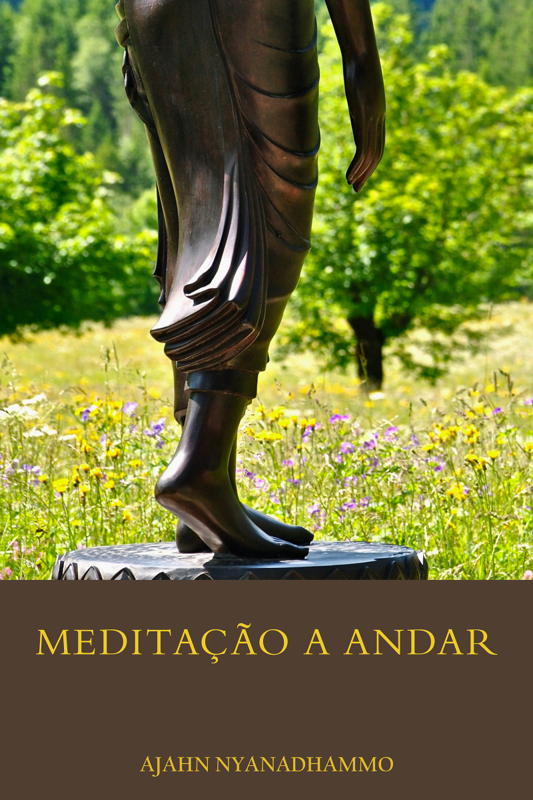

= Meditação a Andar
:booktitle: {doctitle}
:author: Ajahn Nyanadhammo
:creator: {author}
:version: v1.0
:revdate: 2017-10-19
:doctype: book
:lang: pt
:pubs-logo: sumedharama-w100.jpg
:publisher-name: Publicações Sumedhārāma
:publisher-website: www.sumedharama.pt
:source: https://forestsangha.org
:keywords: Ajahn Nyanadhammo, Dhamma, Buddhism, RELIGION / Buddhism / Theravada
:copyright: CC-BY-NC-ND 4.0
:isbn: 978-989-8691-66-8
:identifier: isbn:{isbn}
:imagesdir: assets/photos/92dpi-ebook-sRGB
:includes: manuscript/asciidoc
:front-cover-image: 
:toc: left
:toc-title: Índice
:toclevels: 0

include::{includes}/titlepage.adoc[]

include::{includes}/01-introduction.adoc[]

include::{includes}/02-preparacao.adoc[]

include::{includes}/03-objectos.adoc[]

include::{includes}/04-conclusao.adoc[]

include::{includes}/abbreviations.adoc[]

include::{includes}/copyright.adoc[]

